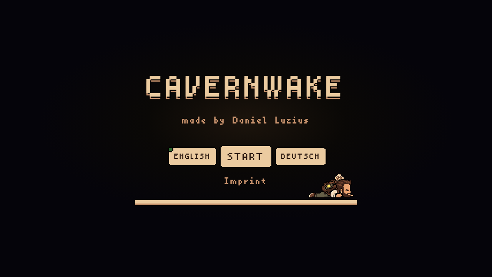

<p align="center">
  
  <a href="README.de.md"></a>
</p>

<p align="center">
  
</p>

# Cavernwake

A pixel-art exploration game in side view, built entirely with **HTML and CSS** — not a single line of JavaScript.

You wake up in a cave system after a fall, separated from your backpack and its light. Tunnels, ladders and elevators connect the rooms. Find your gear, work through the obstacles, and look for a way out.

## Play

Open `index.html` in a browser. No install, no build, no server.

- **Move** with the direction pads at the edge of the vision field (walk, climb, ride lifts).
- **Advance dialogue** with *Next* / *Weiter*.
- **Inventory** is the bag in the top-left. Inspect items and use them on barriers.
- **Settings** is the gear in the top-right: hints, language, imprint, restart.
- **Language** (English / Deutsch) can already be chosen on the title screen.

Nothing is stored on a server. No cookies, no tracking. Progress lives only in the open page; a reload starts over.

A modern browser with CSS Grid, Flexbox and `:checked` is enough.

## HTML and CSS only

The whole game is markup and stylesheets:

- Hidden **radios and checkboxes** hold the state (position, intro/outro, inventory, puzzles).
- **Labels** are the clicks (movement, dialogue, items, settings).
- **Sibling selectors** (`:checked`, `~`, `:is()`) switch the camera, sprite, HUD and obstacles.
- **Keyframes** play walk, climb, idle and cutscene cycles.

Ship `index.html`, `css/main.css` and `assets/` — that is the game.

## What's in it

- Title screen, then an opening cutscene
- A cave graph of **36 stands**, linked by walking, ladders and four elevator shafts
- A lamp vision field around the character (pixel art stays sharp)
- Tools and barriers you pick up and use
- Optional one-shot hint sparks
- An ending once the way out is open

## Layout

```
index.html
css/main.css
assets/
  characters/    character sprite frames
  objects/       inventory icons
  world/         backgrounds, obstacles, UI
  fonts/         Fusion Pixel (SIL Open Font License)
docs/
  title-screen.png
```

## Credits

- Game and pixel art: **Daniel Luzius**
- UI font: [Fusion Pixel](https://takwolf.com) by TakWolf, [SIL OFL 1.1](https://openfontlicense.org)
